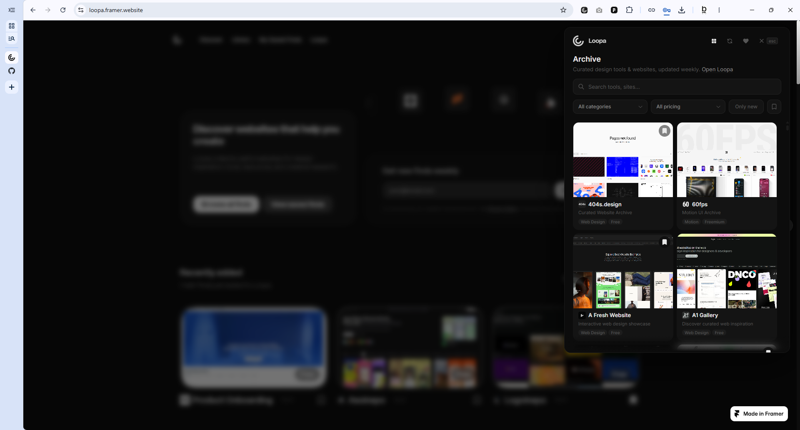
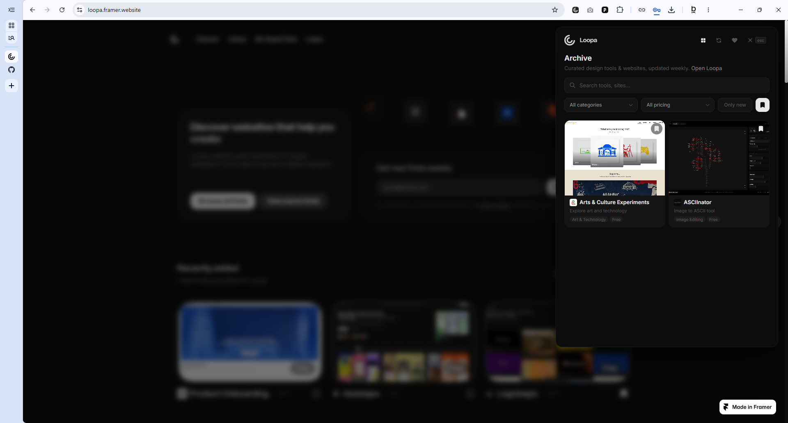
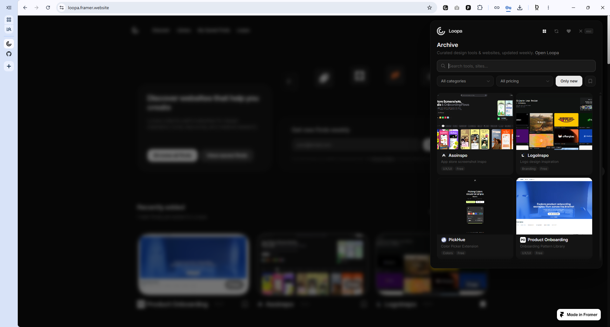
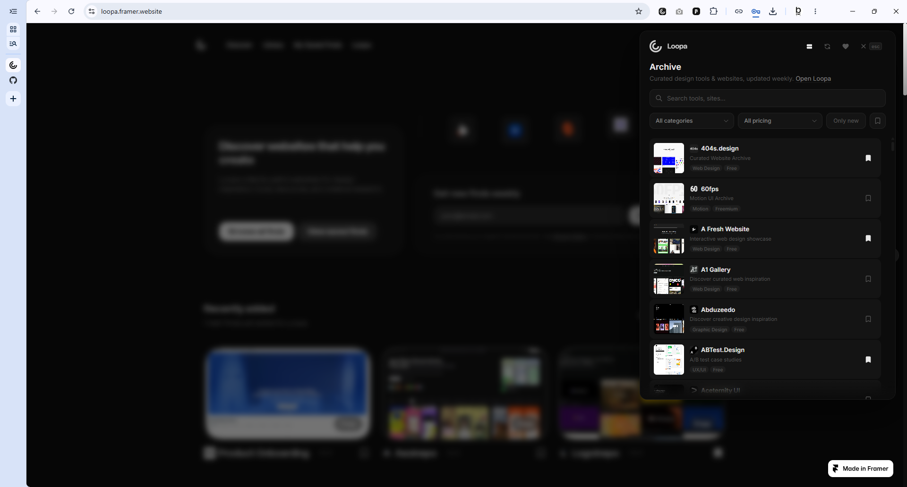
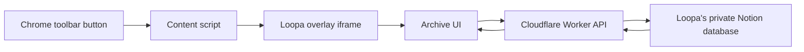

<p align="center">
  
</p>

# Loopa Extension

<p align="center">
  <a href="https://ko-fi.com/bremlo">
    
  </a>
  
  
</p>

Loopa Extension is the source-available Chrome extension add-on for [loopa.framer.websitesite](https://loopa.framer.website). It brings Loopa search, browsing, opening, and saving into the browser toolbar, without requiring the website to be opened first.

The extension opens as a floating panel on top of the active tab, keeping the Loopa collection one click away.

## Screenshots & Features



**Floating Loopa overlay**  
Loopa opens directly on top of the current browser tab. This helps people search and browse the Loopa archive without leaving the page they are already on.

| Grid Browsing | Saved Items |
| --- | --- |
|  |  |

**Grid browsing**  
The grid view is built for visual discovery. Website covers, titles, categories, and pricing labels make it easier to scan Loopa quickly and open something interesting.

**Saved items and quick filters**  
Bookmarks are stored locally in the browser, so useful links can be saved for later. The filter controls help narrow the archive by category, pricing, new entries, and saved items.

| Fast List View |
| --- |
|  |

**Fast list view**  
The list view is made for quick scanning. It reduces the visual weight of the cards and helps compare many Loopa entries faster.

## Features

- **Overlay access:** opens Loopa from the Chrome toolbar, so the archive is available without opening the website manually.
- **Search:** searches titles, websites, descriptions, categories, and pricing labels to find entries faster.
- **Filters:** narrows the archive by category, pricing, new items, and saved items.
- **Grid view:** supports visual browsing with large previews for discovery.
- **List view:** supports compact scanning when speed matters more than previews.
- **Local bookmarks:** saves selected entries in browser storage for quick return visits.
- **External opening:** opens selected websites in a new tab with normal browser navigation.

## How It Works

The extension displays Loopa content from Loopa's own archive. The Notion database behind the archive is maintained privately by Benjamin Michael Bremer for Loopa. Extension users cannot access, edit, or configure that database.



## Technical Breakdown

1. The browser action in `background/service-worker.js` injects `content/overlay.js` into the active tab.
2. `content/overlay.js` creates a Shadow DOM overlay and loads `archive/archive.html` in an iframe.
3. `archive/archive.js` renders the Loopa archive UI, including search, category filters, pricing filters, new-item filtering, grid/list view, and local bookmarks.
4. `lib/storage.js` and `lib/view-preference.js` store local UI state in browser storage.
5. `lib/notion.js` does not talk to Notion directly. It requests archive data from the configured Loopa API endpoint.
6. The Cloudflare Worker in `worker/src/index.js` receives archive requests and keeps server-side access away from the extension bundle.
7. `worker/src/notion-map.js` maps Benjamin's private Notion database pages into the clean JSON format used by the extension UI.

## Project Structure

```text
archive/       Extension UI shown inside the overlay
assets/        Loopa brand assets and README screenshots
background/    Manifest V3 service worker
content/       Overlay injector for the active browser tab
icons/         Extension icons
lib/           Shared browser, storage, API, and icon helpers
worker/        Maintainer-only Loopa API worker
build.ps1      Production packaging script
manifest.json  Chrome extension manifest
```

## Download

The Chrome Web Store listing is coming soon.

For development, load the repository as an unpacked Chrome extension:

1. Clone the repository.
2. Open Chrome and go to `chrome://extensions/`.
3. Enable **Developer mode**.
4. Click **Load unpacked**.
5. Select this project folder.
6. Pin Loopa to the toolbar.

Click the Loopa icon on any regular webpage to open or close the panel.

## Packaging

Run the build script from the project root:

```powershell
.\build.ps1
```

The script checks for obvious leaked secrets, copies only the extension files needed for publishing, and creates a versioned zip file.

## Privacy

- Bookmarks are stored locally in the browser.
- The extension displays Loopa content served through Loopa's API.
- The private Notion database is maintained by Benjamin Michael Bremer for Loopa and is not accessible to extension users.

## License

Copyright (c) 2026 Benjamin Michael Bremer. All rights reserved.

This repository is source-available for transparency. No permission is granted to copy, modify, redistribute, sublicense, or use this project commercially without explicit written permission from Benjamin Michael Bremer.

See [LICENSE](LICENSE) for the full license text.
